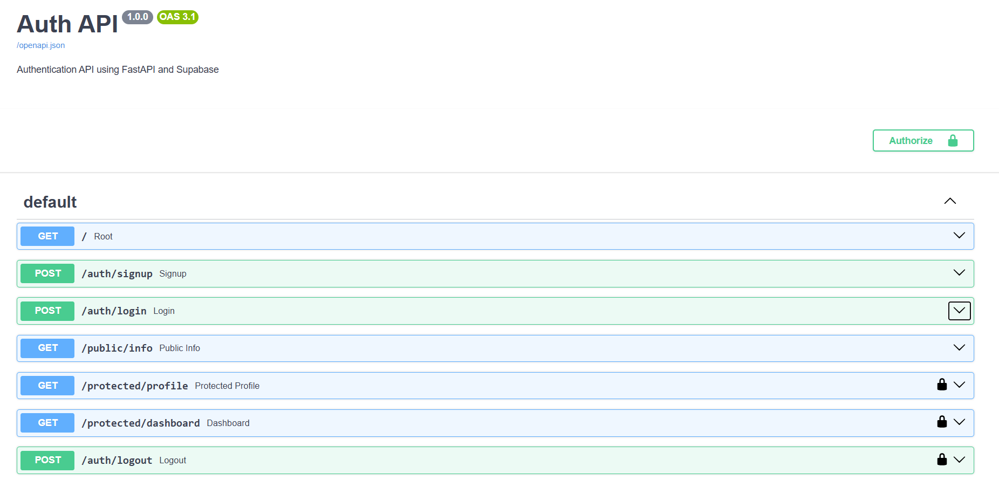

# Auth API using FastAPI & Supabase

## Overview
This project is a secure authentication API built with **FastAPI** and **Supabase Auth**. It supports user registration, login, logout, JWT authentication, and protected routes. The API is fully documented using Swagger UI.

## Features
- User Signup
- User Login
- User Logout
- JWT Authentication
- Protected Routes
- Public Route
- Swagger UI Documentation

## Technologies Used
- Python 3
- FastAPI
- Supabase
- Uvicorn
- Python-dotenv

## Installation

1. Clone the repository:
```bash
git clone https://github.com/NeelamAsghar/auth-api.git
```

2. Go to the project folder:
```bash
cd auth-api
```

3. Install dependencies:
```bash
pip install -r requirements.txt
```

4. Create a `.env` file:

```env
SUPABASE_URL=your_supabase_url
SUPABASE_KEY=your_supabase_anon_key
```

5. Run the server:

```bash
python -m uvicorn main:app --reload
```

## Swagger UI

Open:

```
http://127.0.0.1:8000/docs
```

## API Endpoints

| Method | Endpoint | Authentication |
|--------|----------|----------------|
| GET | / | No |
| POST | /auth/signup | No |
| POST | /auth/login | No |
| POST | /auth/logout | Yes |
| GET | /public/info | No |
| GET | /protected/profile | Yes |
| GET | /protected/dashboard | Yes |

## Authentication

Protected routes require a Bearer Token.

Example:

```
Authorization: Bearer YOUR_ACCESS_TOKEN
```

## Screenshot



## Author

**Neelam Asghar**

BS Information Technology Student

FlyRank Backend Internship Assignment